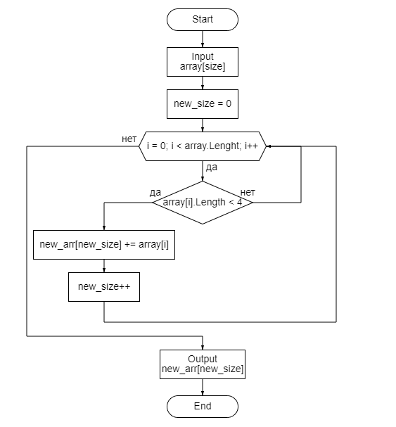

#### *Решение этой задачи разделим на несколько этапов*
---
***Этап 1.***
Первым делом нам нужно получить искомый массив размером *size*, где размер будет задаваться пользователем. Создадим массив строк, и поочередно заполняем массив используя цикл.
Строки будем вводить с клавиатуры, используя конструкцию: *Convert.ToString(ConsoleReadLine()!)*
Для проверки, что мы все сделали правильно, выводим массив на экран.

***Этап 2.***
Перед тем, как заполнить новый массив, нужно узнать его размер, так как не все элементы искомого массива будут удовлетворять условию задачи *(if array[i].Lenght <=3)*. Поэтому пробегаемся по массиву строк циклом и считаем, сколько у нас элементов, удовлетворяющих условию.

***Этап 3.***
Зная размер нового массива, теперь его можно заполнить: проходим еще раз по искомому массиву и записываем элементы, удовлетворяющих условию задачи, в новый массив. Результат выводим на экран.

Блок схема данной задачи будет выглядеть следующим образом:
